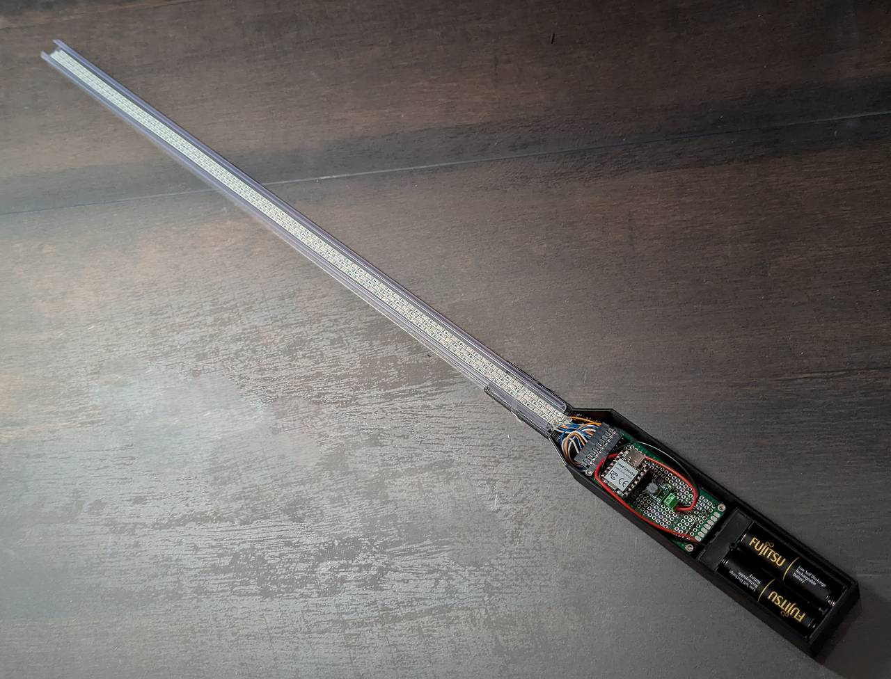
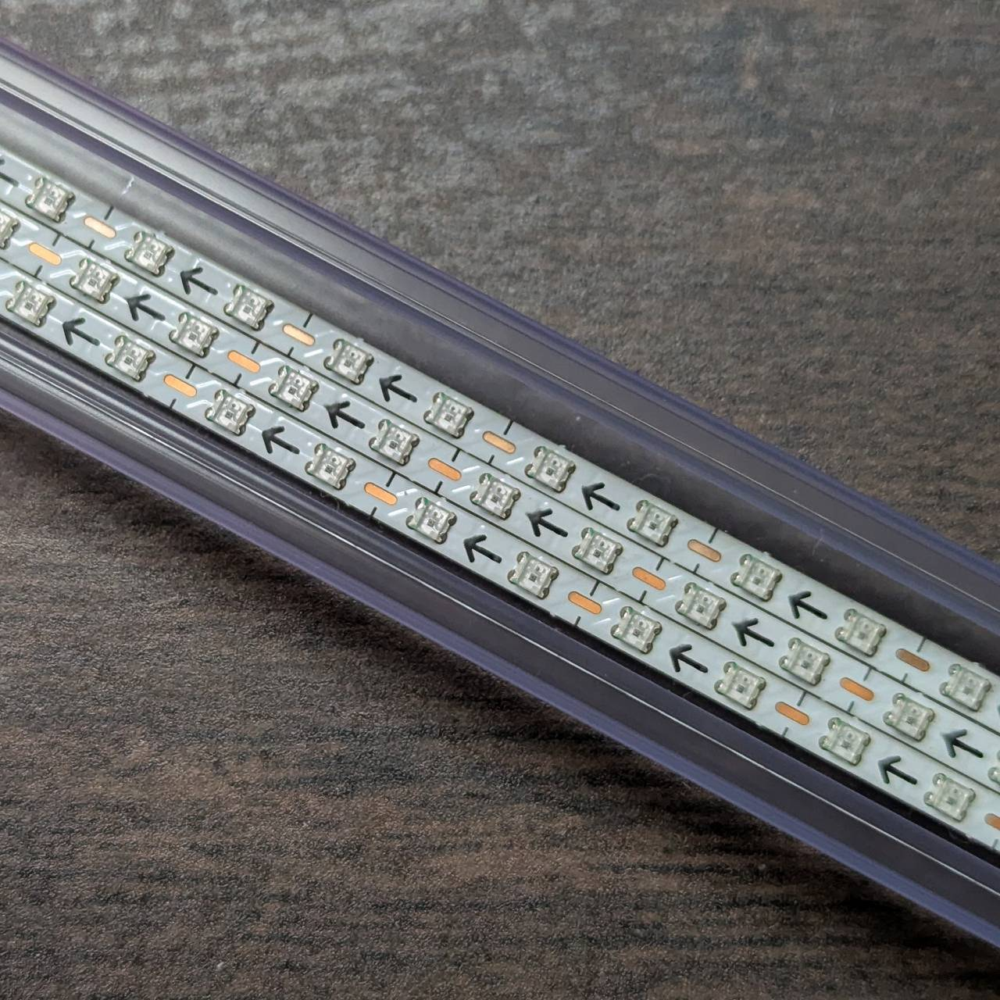
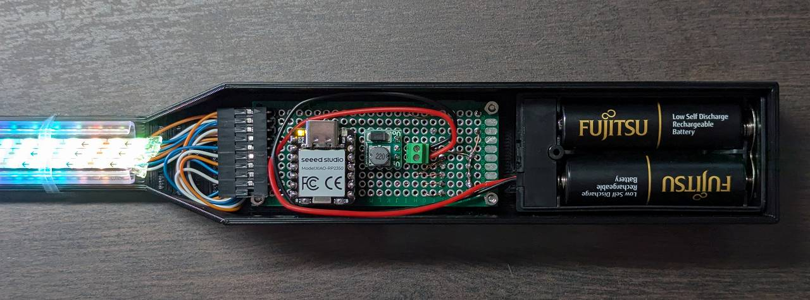
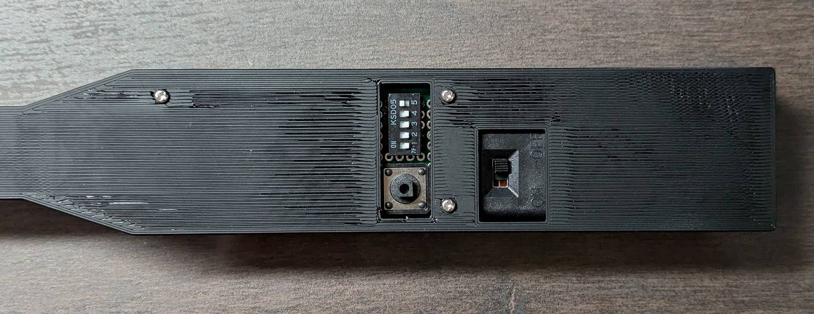
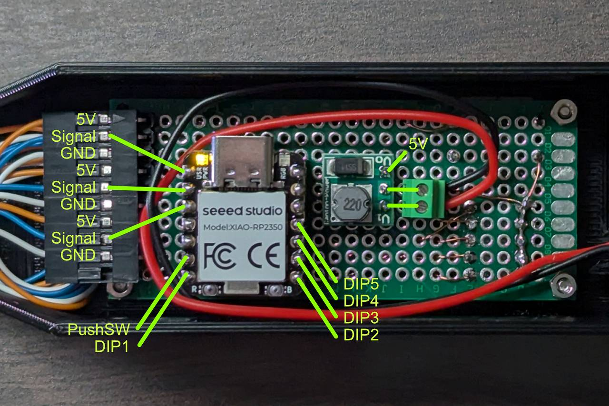

# oreore_poi

XIAO RP2350 controls WS2812B LED strips.

## Build

1. Install VSCode
2. Install Raspberry Pi Pico extension
3. (VSCode) **File -> Open Folder** to open the repository
4. (Raspberry Pi Pico extension) **Compile Project**
    * Click on Raspberry Pi Pico Project button on VSCode Activity Bar if hidden

## Flash

1. Press and Hold the boot button on XIAO RP2350
2. Connect the XIAO RP2350 to your PC via USB
3. Release the boot button
4. (Raspberry Pi Pico extension) **Run Project (USB)**
    * **Flash Project (SWD)** does not work

## Connection

